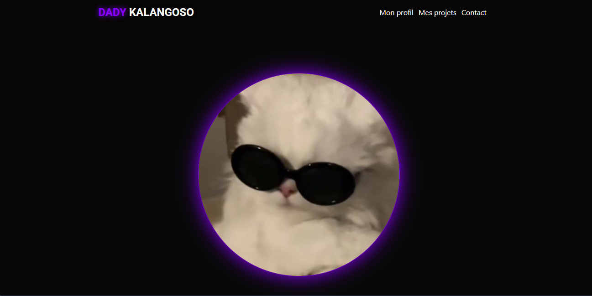

# 🖥️ Portfolio Web — Dady Kalangoso

> Portfolio personnel présentant mes projets, compétences et parcours en développement web version template simple.

---

## 📸 Aperçu



---

## 🚀 Démo en ligne

🔗 [Voir le portfolio](https://dkaizen12.github.io/cv/)

---

## 🛠️ Technologies utilisées

- **HTML5** — Structure sémantique
- **CSS3** — Animations, Flexbox, Grid, Responsive design
- **JavaScript** — Interactions, loader, animations dynamiques
- **Font Awesome** — Icônes
- **Google Fonts** — Police Roboto

---

## ✨ Fonctionnalités

- ✅ Animation de chargement (loader)
- ✅ Animation de texte défilant (effet machine à écrire)
- ✅ Design responsive (mobile, tablette, desktop)
- ✅ Menu de navigation fluide
- ✅ Animations CSS au survol
- ✅ Image de projet
- ✅ footer avec icones réseaux
- ✅ Formulaire de contact

---

## ⚙️ Installation & Utilisation

1. **Cloner le dépôt**
```bash
git clone https://github.com/dkaizen12/cv.git
```

2. **Ouvrir le projet**
```bash
cd cv
```

3. **Lancer le projet**

Ouvre simplement `index.html` dans ton navigateur, ou utilise une extension comme **Live Server** sur VS Code.

---

## 📱 Responsive Design

| Appareil | Breakpoint |
|---|---|
| Mobile | `max-width: 480px` |
| Tablette | `481px — 1024px` |
| Desktop | `min-width: 1024px` |

---

## 🎨 Palette de couleurs

| Couleur | Hex | Usage |
|---|---|---|
| violet principal | `#8c00ff` | Boutons, accents, bordures |
| Noir Sombre | `#080808` | Arriere-plan |
| blanc | `#ffffff` | textes |

---

## 📌 À venir

- [ ] Mode sombre
- [ ] Section blog
- [ ] Galerie de projets filtrée
- [ ] Formulaire de contact fonctionnel

---

## 👤 Auteur

**Ton Nom**
- GitHub : [@dkaizen](https://github.com/dkaizen)
- LinkedIn : [Dady Kalangoso](https://linkedin.com/in/ton-profil)
- Email : dadykalangoso@gmail.com

---

## 📄 Licence

Ce projet est sous licence **MIT** — libre d'utilisation et de modification.